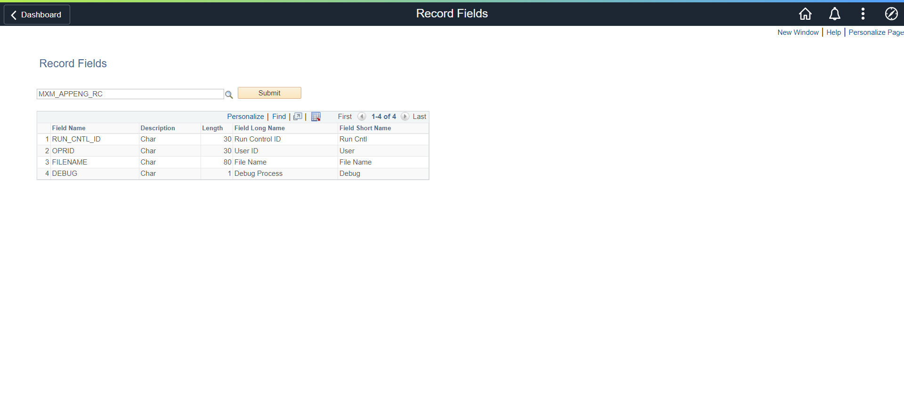
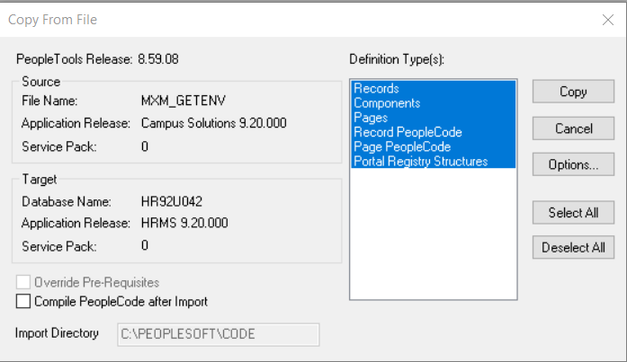
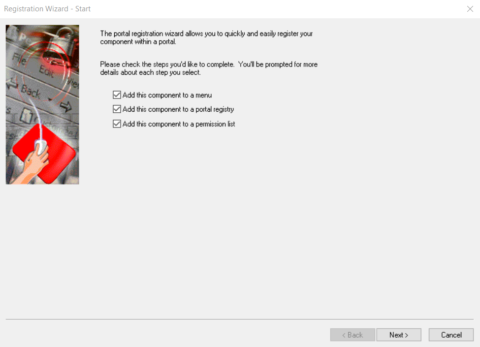

# PeopleSoft Record Fields
PeopleSoft utility to get record fields.



## How to Install
### Step 1: Import the custom menu and folder
1. Launch Application Designer 
2. click Tools, Copy Project, From File...   
3. click Select, choose MXM_CUSTOM_INIT
4. click Copy

### Step 2: Import the project
1. Launch Application Designer
2. Click Tools, Copy Project, From File...   
3. Click Select, choose MXM_REC_FLD
4. Click Copy



### Step 3. Register the component
1. Open the component
2. Click Tools, Register Component...
3. Use component details defined in the Technical Documentation to register the component.




## Technical Documentation
### App Designer Project: MXM_REC_FLD
### Records	
Record: MXM_REC_FLD  
Record Type: Derived/Work  
| Field | Type | Length | Long Descr | Short Descr |
| ------ | --------- | --------- | --------- | --------- |
| RECNAME | Char | 15 | Record (Table) Name | Record |         
| SUBMIT_BTN | Char | 1 | Submit Button | Submit |         
| DESCRLONG | Long | 0 | Description | Descr |

Note: Table edit: RECNAME (PSRECDEFN)

Record: MXM_RECFLD_REC   
Record Type: SQL Table   
| Field | Type | Length | Long Descr | Short Descr |
| ------| --------- | --------- | --------- | --------- |
| FIELDNAME | Char | 18 | Field Name | Field Name |     
| DESCR10 | Char | 10 | Description | Descr |          
| LENGTH | Nbr | 5 | Length | Length |         
| LONGNAME | Char | 30 | Field Long Name | Long Name |      
| SHORTNAME | Char | 15 | Field Short Name | Short Name |   

Record: MXM_RECFLD_TMP   
Record Type:  Derived/Work   
| Field | Type | Length | Long Descr | Short Descr |
| ------| --------- | --------- | --------- | --------- |
| FIELDNAME | Char | 18 | Field Name | Field Name |     
| DESCR10 | Char | 10 | Description | Descr |          
| LENGTH | Nbr | 5 | Length | Length |         
| LONGNAME | Char | 30 | Field Long Name | Long Name |      
| SHORTNAME | Char | 15 | Field Short Name | Short Name | 

### SQL
SQL: MXM_GET_REC_FIELDS
```sql
SELECT psrecfield.fieldname   
 , CASE PSDBFIELD.fieldtype WHEN 0 THEN 'Char' WHEN 1 THEN 'Long' WHEN 2 THEN 'Nbr' WHEN 4 THEN 'Date' WHEN 6 THEN 'DtTm' ELSE '' END FIELDTYPE   
 , PSDBFIELD.length   
 , PSDBFLDLABL.longname   
 , PSDBFLDLABL.shortname   
  FROM psrecfield   
  , PSDBFIELD   
  , PSDBFLDLABL   
 WHERE psrecfield.recname = :1   
   AND psrecfield.fieldname = PSDBFIELD.fieldname   
   AND PSDBFLDLABL.fieldname = psrecfield.fieldname   
   AND PSDBFLDLABL.default_label = 1   
  ORDER BY psrecfield.fieldnum asc;
```

### Page
Page: MXM_REC_FLD  
Title: Record Fields   
MXM_REC_FLD.RECNAME
MXM_REC_FLD.SUBMIT_BTN

Grid: MXM_RECFLD_REC  
MXM_RECFLD_REC.FIELDNAME  
MXM_RECFLD_REC.DESCR10  
MXM_RECFLD_REC.LENGTH  
MXM_RECFLD_REC.LONGNAME  
MXM_RECFLD_REC.SHORTNAME  

### PeopleCode

Event: MXM_REC_FLD PageActivate
```
Local Rowset &GRID_RS;

&GRID_RS = GetLevel0()(1).GetRowset(Scroll.MXM_RECFLD_REC);
&GRID_RS.HideAllRows();
```

Event: MXM_REC_FLD.SUBMIT_BTN FieldChange
```
Local SQL &SQL;
Local Rowset &GRID_RS;
Local Record &MXM_RECFLD_REC;
Local number &counter = 1;

If All(MXM_REC_FLD.RECNAME.Value) Then
   &GRID_RS = GetLevel0()(1).GetRowset(Scroll.MXM_RECFLD_REC);
   &GRID_RS.Flush();
   &SQL = CreateSQL(SQL.MXM_GET_REC_FIELDS, MXM_REC_FLD.RECNAME.Value);
   &MXM_RECFLD_REC = CreateRecord(Record.MXM_RECFLD_REC);
   
   While &SQL.Fetch(&MXM_RECFLD_REC)
      &MXM_RECFLD_REC.CopyFieldsTo(&GRID_RS(&counter).MXM_RECFLD_REC);
      &GRID_RS.InsertRow(&counter);
      &counter = &counter + 1;
   End-While;
   
   If None(&GRID_RS(&counter).MXM_RECFLD_REC.FIELDNAME.Value) Then
      &GRID_RS.DeleteRow(&counter);
   End-If;
   
   &GRID_RS.ShowAllRows();
End-If;
```

### Component

| Component | MXM_REC_FLD | 
| ------| --------- |
| Page | MXM_REC_FLD | 
| Navigation | Custom Components > Record Fields | 
| Item Label | Record Fields | 
| Search Record | INSTALLATION |
| Add | Selected | 
| Update Display | Selected |
| Disable Saving Page | Selected | 
| Menu | MXM_CUSTOM_MENU |
| Bar item Name | MENUITEM | 
| Portal | Employee |
| Folder Name | MXM_CUSTOM | 
| Content Reference label | Record Fields |
| Long Description | Record Fields | 
| Sequence Number | 0 |
| Always Use Local Node | Selected | 
| Permission Lists | PTPT1200 |
| Actions | Add, Update/Display |


## Feedback:
Please create a GitHub Issue for any bugs, feature requests, etc. Happy to accept pull requests too!
